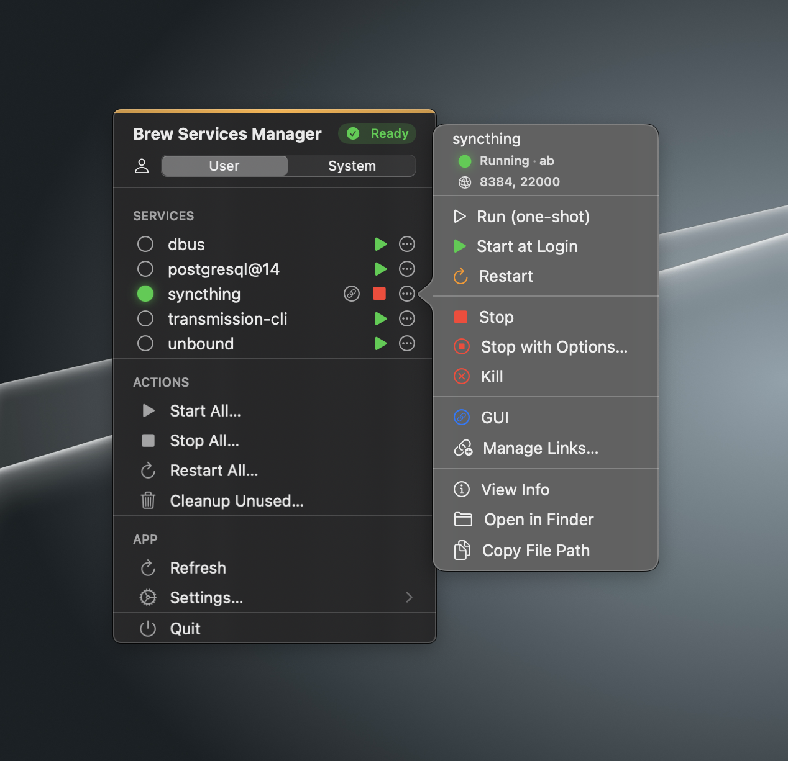

# BrewServicesManager

<p align="center">
  
</p>

<p align="center">
  <strong>A macOS menu bar app for managing Homebrew services</strong>
</p>

<p align="center">
  
  
  
  
</p>

---

## Screenshot

<p align="center">
  
</p>

---

## Overview

A macOS menu bar app for managing Homebrew services. Start, stop, and restart services without the terminal.

### Key Features

- **Homebrew Integration** — Manage all `brew services` from the menu bar
- **Real-time Status** — View service status at a glance
- **Quick Actions** — Start, stop, and restart services instantly
- **Port Detection** — Automatically detect and display listening ports for running services
- **Service Links** — Configure custom URLs for quick access to service web interfaces
- **System Domain Support** — Manage both user and system-level services with privilege escalation
- **Launch at Login** — Optionally start the app automatically when you log in
- **Auto-refresh** — Configurable refresh interval
- **Debug Mode** — Verbose output for troubleshooting

---

## Requirements

- **macOS 15.0** (Sequoia) or later
- **Homebrew** installed and configured
- Services installed via Homebrew (e.g., `brew install postgresql`, `brew install redis`)

---

## Installation

### Option 1: Download Pre-built Release

1. Download the latest `.dmg` from the [Releases](https://github.com/validatedev/BrewServicesManager/releases) page
2. Open the DMG and drag **BrewServicesManager** to your Applications folder
3. Launch the app from Applications or Spotlight

### Option 2: Build from Source

1. Clone the repository:
   ```bash
   git clone https://github.com/validatedev/BrewServicesManager.git
   cd BrewServicesManager
   ```

2. Open the project in Xcode:
   ```bash
   open BrewServicesManager.xcodeproj
   ```

3. **Configure Code Signing** (first time only):
   - Select the **BrewServicesManager** project in the navigator
   - Select the **BrewServicesManager** target
   - Go to **Signing & Capabilities** tab
   - Select your **Team** from the dropdown (requires Apple Developer account)

4. Build and run (⌘R) or archive for distribution (Product → Archive)

---

## Usage

### Getting Started

1. **Launch the App** — BrewServicesManager runs as a menu bar-only application. Look for the mug icon (☕) in your menu bar.

2. **View Services** — Click the menu bar icon to see all your Homebrew services and their current status.

3. **Manage Services** — Hover over a service to reveal quick actions:
   - **▶️ Start** — Start a stopped service
   - **⏹️ Stop** — Stop a running service
   - **🔄 Restart** — Restart a running service
   - **ℹ️ Info** — View detailed service information

### Port Detection

BrewServicesManager automatically detects listening ports for running services:

- **Automatic Detection** — Ports are detected from the main process and all child processes
- **Quick View** — See the first 3 ports in the service actions popover (e.g., "8384, 22000")
- **Detailed View** — Click "View Info" to see all ports with protocol information (TCP/UDP)
- **Works with Complex Services** — Detects ports from services that spawn worker processes (like Syncthing, nginx)

Port detection happens automatically when you view service information. No configuration needed!

### Service Links

Add custom URLs to quickly access service web interfaces:

1. **Click the three-dots menu** on any service
2. **Select "Manage Links..."** to open the link management interface
3. **Add a link:**
   - Click on an auto-suggested URL (based on detected ports), or
   - Click "Add Custom Link" to enter any URL manually
   - Optionally add a custom label (e.g., "Admin Panel", "Metrics")
4. **Access your links** — They appear as clickable icons next to the service name

**Examples:**
- Syncthing → `http://localhost:8384` (Web UI)
- Local API → `http://localhost:3000` (Development server)
- nginx → `http://localhost:80` (Web server)

Links are saved automatically and persist across app restarts.

### Service Domains

BrewServicesManager supports two service domains:

| Domain | Description | Privileges |
|--------|-------------|------------|
| **User** | Services running under your user account | Standard user permissions |
| **System** | System-wide services (root-level) | Requires administrator password |

Switch between domains in **Settings → Service Domain**.


### Global Actions

Perform bulk operations on all services:

- **Start All** — Start all stopped services
- **Stop All** — Stop all running services  
- **Restart All** — Restart all services

### Settings

Access settings via the ⚙️ **Settings** menu item:

- **Service Domain** — Switch between User and System domains
- **Sudo Service User** — Specify a user for sudo operations (system domain)
- **Auto-refresh Interval** — Set how often to refresh the service list (0 = disabled)
- **Debug Mode** — Enable verbose output for troubleshooting
- **Launch at Login** — Automatically start the app when you log in to macOS

---


## Building & Development

### Prerequisites

- Xcode 26.0 or later
- macOS 15.0 or later (for running)
- Homebrew (for testing service management)
- Apple Developer account (free or paid, for code signing)

### Code Signing Setup

Before building, you need to configure code signing:

1. Open the project in Xcode
2. Select **BrewServicesManager** project → **BrewServicesManager** target
3. Go to **Signing & Capabilities**
4. Select your team from the dropdown

The project does not include a hardcoded development team, allowing each contributor to use their own Apple Developer account.

### Build Commands

```bash
# Build for development
xcodebuild -scheme BrewServicesManager -configuration Debug build

# Build for release  
xcodebuild -scheme BrewServicesManager -configuration Release build

# Run tests
xcodebuild -scheme BrewServicesManager test
```

---

## Troubleshooting

### Common Issues

<details>
<summary><strong>BrewServicesManager can't find Homebrew</strong></summary>

Ensure Homebrew is installed and accessible:
```bash
# Check if brew is in PATH
which brew

# If using Apple Silicon, ensure /opt/homebrew/bin is in PATH
echo $PATH
```

BrewServicesManager searches for Homebrew in:
- `/opt/homebrew/bin/brew` (Apple Silicon)
- `/usr/local/bin/brew` (Intel)

</details>

<details>
<summary><strong>Services show "Error" status</strong></summary>

1. Open **Service Info** by clicking the ℹ️ button
2. Check the error message and exit code
3. Enable **Debug Mode** in Settings for verbose output
4. Verify the service plist is valid:
   ```bash
   brew services info <service-name>
   ```

</details>

<details>
<summary><strong>Port detection not showing any ports</strong></summary>

Port detection only works for **running** services. Ensure:
1. The service is actually running (status shows "started")
2. The service is listening on TCP/UDP ports
3. You have the necessary permissions to run `lsof`

To verify manually:
```bash
# Check if service is listening
lsof -nP -iTCP -sTCP:LISTEN | grep <service-name>
```

</details>

<details>
<summary><strong>System authentication dialog appears but can't be clicked</strong></summary>

This issue has been fixed in recent versions. If you encounter this:
1. Update to the latest version of BrewServicesManager
2. The authentication dialog should now accept mouse input properly
3. If issues persist, you can still use keyboard navigation (Tab to move between fields, Space/Enter to click buttons)

</details>

---

## License

This project is licensed under the MIT License — see the [LICENSE](LICENSE) file for details.

---

## Acknowledgments

- [Homebrew](https://brew.sh/) — The missing package manager for macOS
- [SF Symbols](https://developer.apple.com/sf-symbols/) — Apple's iconography system
- [SwiftAgents](https://github.com/twostraws/SwiftAgents) - Base `AGENTS.md` file for best practices

---

<p align="center">
  Made with 🦆
</p>
